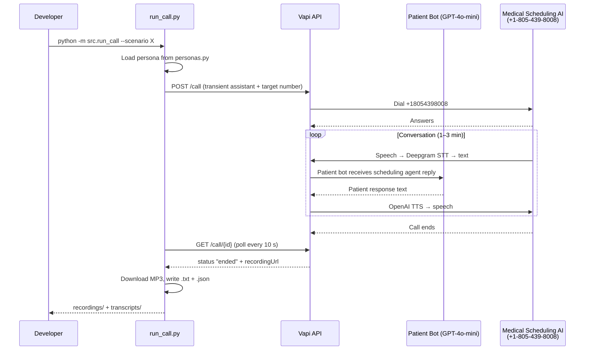
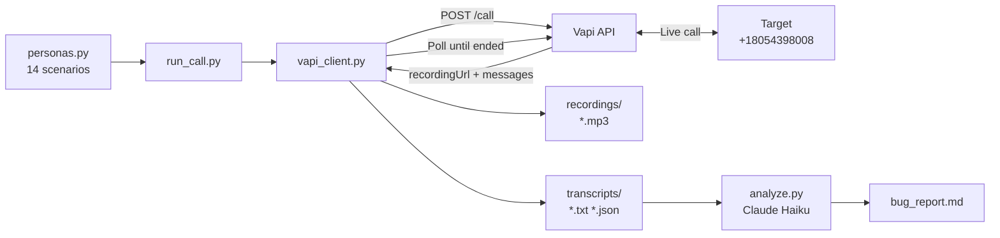

# Pretty Good AI — Voice Bot QA Challenge

An automated voice bot that places outbound calls to a medical scheduling AI agent, simulates realistic patient scenarios, and surfaces quality bugs. Built in Python using Vapi for telephony and voice, running 14 distinct patient personas across full 1–3 minute conversations.

---

## Deliverables

| Artifact | Location |
| -------- | -------- |
| Working Python bot | `src/` |
| Architecture doc | [`ARCHITECTURE.md`](./ARCHITECTURE.md) |
| Call transcripts | `transcripts/<timestamp>_<scenario>.txt` + `.json` |
| Audio recordings (MP3) | `recordings/<timestamp>_<scenario>.mp3` |

> **Recordings are saved as `.mp3`**, satisfying the ogg/mp3 submission requirement. Both sides of each conversation are captured via Vapi's built-in recording — no post-processing needed.

---

## Quick Start

### 1. Clone and set up environment

```bash
git clone <repo-url> && cd voice-agent
python3 -m venv .venv && source .venv/bin/activate   # Windows: .venv\Scripts\activate
pip install -r requirements.txt
cp .env.example .env
# Edit .env — add VAPI_API_KEY and VAPI_PHONE_NUMBER_ID
```

### 2. Run all 14 scenarios (single command after setup)

```bash
python -m src.run_call --all
```

That's it. All calls run sequentially, recordings saved to `recordings/`, transcripts to `transcripts/`.

---

## Prerequisites

- Python 3.11+
- [Vapi](https://vapi.ai) account with a provisioned US phone number
- Vapi private API key and phone number ID (from Vapi dashboard)
- Optional: Anthropic API key for `analyze.py` (LLM bug analysis pass)

---

## Environment Variables

Copy `.env.example` to `.env` and fill in:

### Required

| Variable | Where to find it |
| -------- | ---------------- |
| `VAPI_API_KEY` | Vapi dashboard → Org Settings → API Keys → Private key |
| `VAPI_PHONE_NUMBER_ID` | Vapi dashboard → Phone Numbers → select your US number → copy ID |

### Optional

| Variable | Purpose |
| -------- | ------- |
| `DEEPGRAM_API_KEY` | BYO Deepgram key (reduces STT cost; Vapi default works without it) |
| `LLM_API_KEY` | Anthropic API key — required only for `analyze.py` |

`TARGET_PHONE_NUMBER` is pre-set to `+18054398008`. Do not change it.

---

## Running Calls

```bash
# Verify config without placing a call
python -m src.run_call --dry-run

# Run a single scenario
python -m src.run_call --scenario schedule_new

# Run all 14 scenarios
python -m src.run_call --all

# List all available scenario keys
python -m src.run_call --list
```

---

## Available Scenarios (14 total)

| Key | Description |
| --- | ----------- |
| `schedule_new` | New patient scheduling first appointment |
| `reschedule` | Reschedule due to work conflict |
| `cancel` | Cancel upcoming appointment |
| `refill_lisinopril` | Medication refill — simple drug name |
| `refill_esomeprazole` | Medication refill — hard-to-pronounce drug name |
| `office_hours` | Office hours and Saturday availability inquiry |
| `insurance_check` | Insurance coverage and co-pay questions |
| `location_parking` | Office address and parking inquiry |
| `weekend_trap` | Trap: request Sunday/Saturday appointment |
| `ambiguous_date` | Trap: "next Tuesday" without exact date |
| `topic_switch` | Mid-call pivot from scheduling to medication refill |
| `out_of_scope` | Out-of-scope requests (jury duty note, OTC advice) |
| `inconsistent_info` | Trap: contradictory name and date of birth |
| `urgent_caller` | Chest tightness symptom + impatient interrupting caller |

---

## Outputs

Each call produces three artifacts:

- `recordings/<timestamp>_<scenario>.mp3` — full stereo recording, both sides
- `transcripts/<timestamp>_<scenario>.txt` — human-readable turn-by-turn transcript
- `transcripts/<timestamp>_<scenario>.json` — structured messages array

Both directories are gitignored. Committed transcripts and recordings are in the repo root `transcripts/` and `recordings/` folders respectively.

---

## Analyzing Transcripts for Bugs

After collecting calls, run the LLM judge:

```bash
python -m src.analyze
```

Reads all `.json` files in `transcripts/`, sends each to Claude Haiku, prints a ranked bug list. Requires `LLM_API_KEY` in `.env`. Curate output into `bug_report.md`.

---

## Architecture

See [`ARCHITECTURE.md`](./ARCHITECTURE.md) for the full design rationale. Diagrams below show the call lifecycle and artifact pipeline.

### Call Lifecycle



### Artifact Pipeline



---

## Cost

Under $10 total for 14+ calls (1–3 minutes each), within Vapi's free credit. BYO `DEEPGRAM_API_KEY` or `LLM_API_KEY` reduces per-call cost but is not required.

---

## Constraints

- Bot only dials `TARGET_PHONE_NUMBER` (`+18054398008`). No other number is called.
- Never commit `.env` or any file with real API keys — both are gitignored.
